# Hola, soy Beckan 👋

Estudiante de **Ingeniería Informática** enfocado en **desarrollo backend**.
Construyo para aprender — estos son mis proyectos más relevantes hasta ahora.

---

## 🛠️ Tecnologías

---

## 📂 Proyectos relevantes

- [**BlindSector**](https://github.com/BeckanG728/blind-sector)
- [**SportPulse**](https://github.com/BeckanG728/Equipo10-SportPulseMS)

---

## 📊 Actividad

---

## 📬 Contacto

